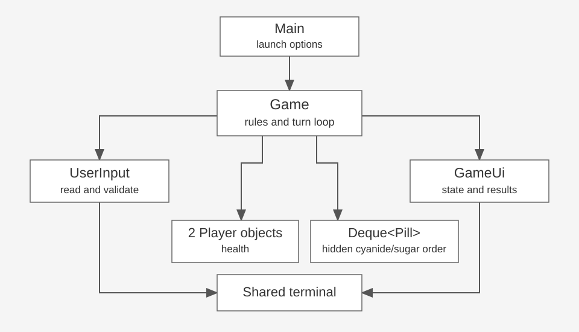

# Pill Roulette

A terminal prediction game for two local players sharing one keyboard. Each turn,
choose whether to take the next hidden pill or give it to the other player. The
remaining cyanide and sugar counts help you judge the risk.

## Compile and run

Requires a **JDK 11 or newer** (`java` and `javac`). No external library is needed to play.
From the repository root, compile and run with:

```sh
./scripts/run.sh
```

That script compiles before launching. The equivalent manual commands are:

```sh
mkdir -p build/classes
javac --release 11 -encoding UTF-8 -d build/classes Pill_Roulette/src/*.java
java -cp build/classes Main
```

The scripts use Bash (macOS, Linux, or Git Bash on Windows). The Java commands also
work in a terminal with a JDK on its path. Eclipse users can import the existing
`Pill_Roulette` project, select JDK 11+, and run `Main`. Its test folder uses the
JUnit 5 library container.

## Rules and controls

- Both players start with 3 health. Player 1 goes first.
- A normal game shuffles 5 cyanide and 5 sugar pills. Their order is hidden.
- Enter exactly `1` to take the next pill or `2` to give it to the other player.
- Cyanide costs its recipient 1 health. Sugar costs 0 health.
- Every valid action uses one pill. Turns alternate, including after sugar.
- A player at 0 health loses. If a configured sequence runs out while both players
  survive, the result is a draw. No automatic refill occurs.
- Blank, text, decimal, negative, and unsupported commands produce an error and
  retry without consuming a pill, losing health, or changing turns. Surrounding
  whitespace is allowed (` 1 ` is valid).
- End input with Ctrl-D on macOS/Linux (Ctrl-Z then Enter on Windows) to stop cleanly.

This follows the supplied **specification's two-player design**. There is no
computer-controlled dealer in this version.

## Tutorial and repeatable demo

```sh
./scripts/run.sh --tutorial
./scripts/run.sh --demo
./scripts/run.sh --seed 64
./scripts/run.sh --help
```

`--demo` uses the known sequence cyanide, sugar, cyanide, sugar, cyanide. First enter
`banana`, a blank line, `0.1`, `-1`, and `12` to show error handling. Then enter
`2`, `1`, `2`, `1`, `2`. Player 1 finishes at 3 health and wins when Player 2 reaches 0.
The seeded option repeats a shuffled normal game for debugging. Demo and seed
cannot be used together. `--tutorial` can accompany either mode.

For an automated rehearsal of the same moves:

```sh
./scripts/run.sh --demo < docs/demo-input.txt
```

## Run JUnit tests

```sh
./scripts/test.sh --details=summary
```

The first run needs `curl` and an internet connection. It downloads the pinned
[JUnit Platform Console Standalone 1.11.4](https://docs.junit.org/5.11.4/user-guide/index.html#running-tests-console-launcher)
runner from Maven Central and checks its SHA-256 checksum. Later runs use the
ignored `.deps` cache. No Maven or Gradle installation is required. Test reports
are written to `build/test-results/`.

Tests cover each MVP class and its public methods, including normal behavior and
bad input or a meaningful boundary. Examples include negative damage, non-string
objects, closed input, exhausted queues, repeatable games, and 10,000 invalid
commands without recursive calls. See [the test map](docs/test-map.md).
GitHub Actions compiles and runs the suite on Java 11 and Java 17 for every push
and pull request.

## System diagram and source



[Diagram explanation and editable Mermaid source](docs/system-diagram.md)

| File | Responsibility |
| --- | --- |
| `Main.java` | Validate launch options and create the game |
| `Game.java` | Own the queue, players, current turn, and game rules |
| `Player.java` | Validate and update health, clamped at zero |
| `Pill.java` | Store an immutable cyanide/sugar identity |
| `UserInput.java` | Read input and accept only supported commands |
| `GameUi.java` | Format status, tutorial, errors, and outcomes |

Production source is in `Pill_Roulette/src/`; JUnit tests are in
`Pill_Roulette/test/`. `GavinTomlinson.java` is the original teammate check-in file,
not part of the game entry point. The earlier unused `Roulette` data sketch remains
available in Git history; `Game` replaces it with the specified class design.

## Scope decisions and stretch goals

Implemented MVP: a complete playable loop, hidden pill sequence, health, remaining
counts/percentages, take/give choices, alternating turns, terminal results, and
safe invalid-input handling.

Implemented stretches: an optional strategy tutorial and static ASCII status
graphics. Powerups, animated screens, a computer dealer, and round refills are
future work.

The earlier README described 5 health and a dealer. The later spec chose 3 health
and alternating players, so the implementation follows that spec. The spec's
`display()` interaction wording is refined: `display()` only prints, `startTurn()`
runs one turn, and `play()` owns an iterative loop. This prevents stack growth
when users repeatedly mistype. End of input cancels cleanly rather than retrying
forever. An empty configured sequence is already over. Game-over state is derived
from health and the queue instead of storing a redundant flag.

## Presentation and team workflow

The final slide deck is in `presentation/Pill-Roulette-Presentation.pptx`. It is
editable and can be imported into Google Slides. The speaker notes provide a
10-minute route through the four rubric sections, including a two-minute live
demo. Review the reflection material in your own words before presenting.

GenAI was used for code generation, completion, and testing, as well as preparing
the requested presentation. Generated changes still need to be understood and
defended by the group. Existing commit history is preserved. New commits use the
configured account and do not claim to be work authored by another teammate.
Each member should make their own genuine follow-up contributions under their
own Git identity; the commit history must reflect actual work.

Before lab: rehearse the demo and run the tests, upload the PPTX to Canvas, and
paste the public repository URL into the Canvas submission comment. The slide
file and repo do not automatically submit themselves to Canvas.
