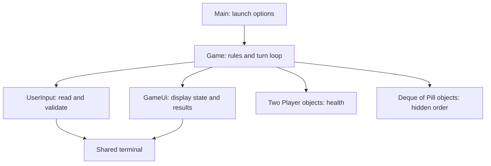

# System diagram

`Game` asks `UserInput` for an action and changes the recipient's `Player` health
using the next `Pill` in its `Deque`. It then asks `GameUi` to print the result.
`GameUi` can inspect public game state but does not change it. The UI sees remaining
counts, not the future pill order. All input retries and turns use loops.

A `Pill` is immutable. The constructor copies the sequence into a new queue, so
changing the original list cannot rearrange a running game. Health rejects negative
damage and never falls below zero. There is no implemented `PowerUp` class because
items remain a stretch goal.
